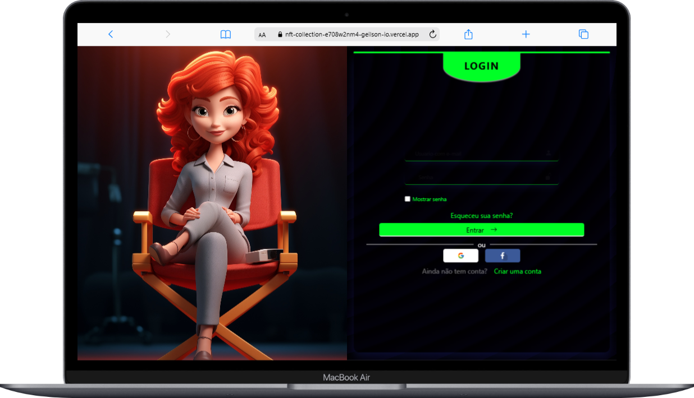
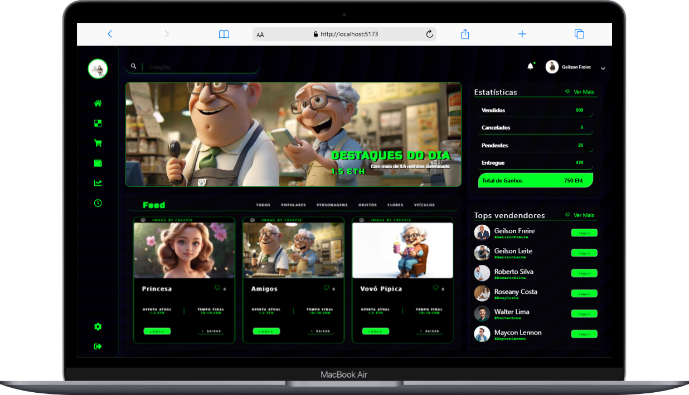
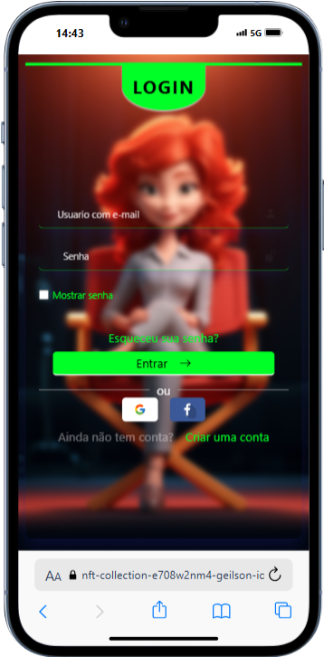
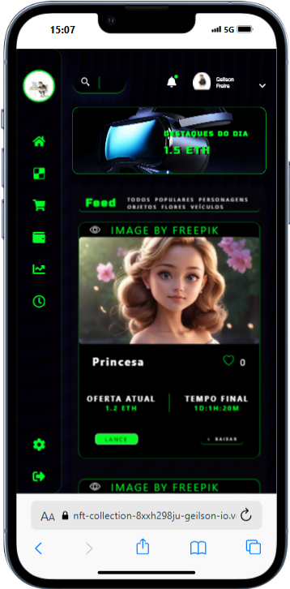
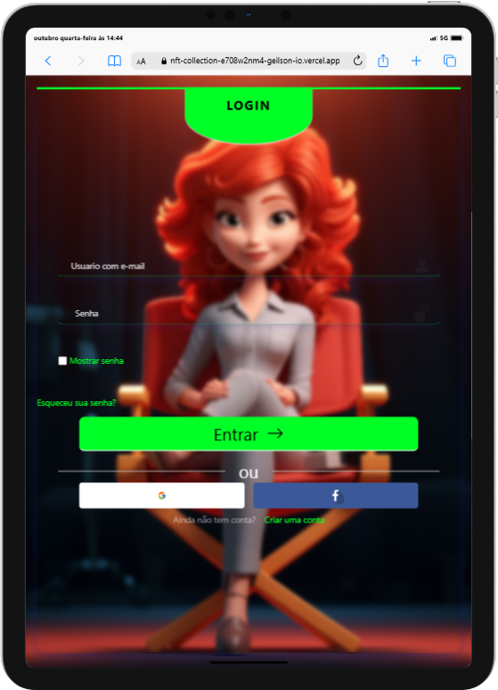
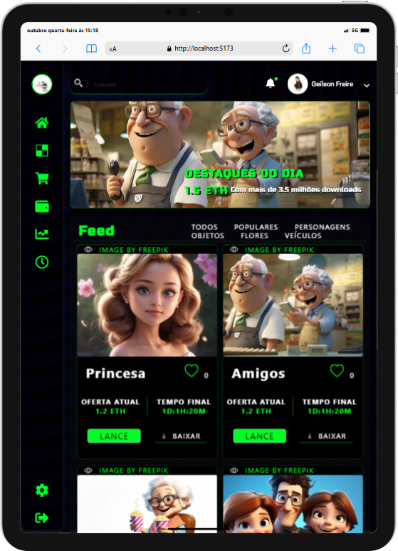

# NFT Colletions
- 

- Descrição do projeto:

NFT Collections é uma aplicação web desenvolvida em React que permite aos usuários gerenciar e visualizar suas coleções de NFTs (Tokens Não Fungíveis). A aplicação utiliza Firebase para autenticação, permitindo login com email/senha e conta Google, garantindo uma experiência de usuário segura e conveniente.

- Funcionalidades Principais:
- - Autenticação de Usuário:  
Login e registro de usuários utilizando email e senha.  
Login com conta Google para uma autenticação rápida e segura.
- - Gerenciamento de NFTs:  
Adicionar, editar e remover NFTs da coleção pessoal.  
Visualizar detalhes dos NFTs, incluindo imagens, descrições e metadados.
- - Interface Intuitiva:  
Design responsivo e amigável, proporcionando uma experiência de usuário fluida em dispositivos móveis e desktops. 
Navegação fácil e intuitiva entre as diferentes seções da aplicação.
- - Tecnologias Utilizadas: 
React: Biblioteca JavaScript para construção da interface de usuário. 
Firebase Authentication: Serviço de autenticação para gerenciamento de usuários. 
Deploy: vercell

### Dependencias 
- Antes de utilizar o projeto instale todas as dependências 
No console dentro da pasta do projeto ( npm install ) 
Crie um arquivo .env e adicione:  
- - VITE_FIREBASE_API_KEY=Seu-key-aqui  
VITE_FIREBASE_AUTH_DOMAIN=Seu-dominio-aqui 
VITE_FIREBASE_PROJECT_ID=ID-do-seu-projeto-aqui 
VITE_FIREBASE_STORAGE_BUCKET=sotorange-aqui 
VITE_FIREBASE_MESSAGING_SENDER_ID=ID-aqui 
VITE_FIREBASE_APP_ID=ID-app-aqui 
VITE_FIREBASE_MEASUREMENT_ID=aqui